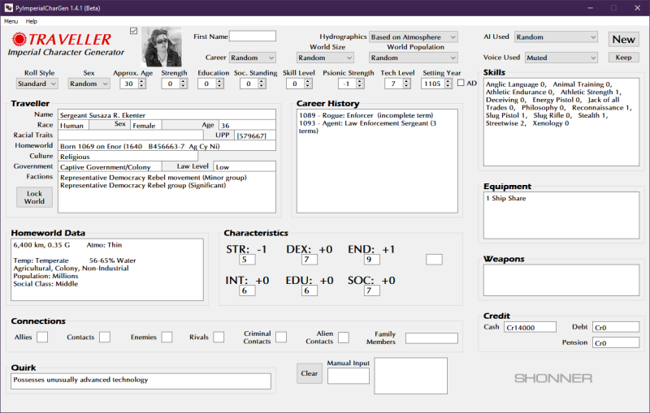

	

**Traveller NPC CharGen**
=========================

**Traveller NPC CharGen** is a Windows program for generating NPCs, based on rules from
Mongoose Traveller First Edition and Traveller 5.10.

Notes
-----

**Traveller NPC CharGen** is being developed using Python 3.11 and PyQt5.

Requirements
------------

* **Windows 11**

  It will also work with Windows 10.

Executing
---------

Run the .EXE for Windows 11 to start.

This program generates characters (using brute force) until a character is made that best matches the
chosen settings. It is possible to get stuck in an infinite loop if the chosen settings are unlikely
to generate a character. Simply use CTRL+C to exit out of the program.

During chargen, raw CSV and
JSON files are created in the data folder. The raw files can be used by CSV and JSON readers to mine
for data. The last character recorded in the raw files will be the one generated by the app.

Things To-Do
------------

| Instruction manual.
| Cheat codes.
| Iron Man Character Generation.
| Continue on character sheet PDF generation.

Known History
-------------

* v1.8.2b

  Fixed TAB order.
  **Clear** (now **Clear All**) button clears everything now.

* v1.8.1b

  DEX, END, and INT buttons weren't connected to any code. They function now.

* v1.8.0b

  **Clear Button** removes old Characteristic Modifiers.
  New **Print Button** saves a character as a PDF (partial sheet).
  Will **Keep** a Traveller in a database if MongoDB 4.4.5 is installed.
  Will **Load** a Traveller from a database if MongoDB 4.4.5 is installed.
  
* v1.7.0b

  Generates a homeworld first before generating a character.
  This makes chargen much faster now.

* v1.6.3b

  Planets with no trade codes are listed as Unknown now.

* v1.6.2b

  Last names can be manually entered now.

* v1.6.1b

  Tweaked the random name generator a bit.

* v1.6.0b

  Updated to Python 3.11.0.

* v1.5.1b

  Nexus 6 chargen is now 1d6+9 instead of 2d6+3.

* v1.5.0b

  Removed the gTTS features from the program.

* v1.4.2b

  Restored skills back to their original Mongoose Traveller names.

* v1.4.1b

  Uses pydice for dice rolls now.

* v1.4.0b

  Dice rolls can now be made at the CMD prompt.

* v1.3.0b

  **colorama** is no longer required.

* v1.2.0b

  Added a Manual Input window for die rolling.

* v1.1.0b

  Uploaded to GitHub. MongoDB and Google TTS features will not work with this Beta.

* v0.0.1b

  Initial release.

The Traveller game in all forms is owned by Far Future Enterprises. Copyright 1977 - 2024 Far Future Enterprises. Traveller is a registered trademark of Far Future Enterprises.

Contact
-------
Questions? Please contact shawndriscoll@hotmail.com
