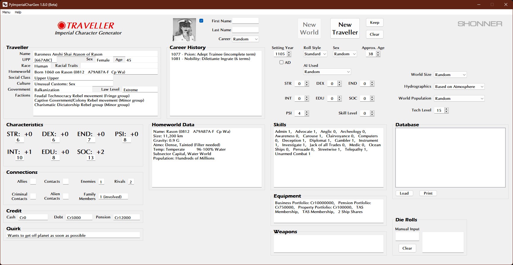

	

**Traveller NPC CharGen**
===========================

**Traveller NPC CharGen** is a Windows program for generating NPCs, based on rules from
Mongoose Traveller Second Edition and Traveller 5.10.

Notes
-----

**Traveller NPC CharGen** is being developed using Python 3.9.13 and PyQt5.

Requirements
------------

* **Windows 10**

  It might not work in OSX or Linux.

Run the .EXE for Windows 10 to start.

.. |ss| raw:: html

    <strike>

.. |se| raw:: html

    </strike>

Things To-Do
------------

| Instruction manual.
| Cheat codes.
|ss|

| Replace PyDiceroll with new pydice module.
| Roll dice at CMD prompt.
| Add manual input for die rolls.
| Put back "some" Traveller 5 stuff that was removed.
| Start on a To-Do.

|se|

**Known History**

* v1.5.0b

  Removed the gTTS features from the program.

* v1.4.2b

  Restored skills back to their original Mongoose Traveller names.

* v1.4.1b

  Uses pydice for dice rolls now.

* v1.4.0b

  Dice rolls can now be made at the CMD prompt.

* v1.3.0b

  **colorama** is no longer required.

* v1.2.0b

  Added a Manual Input window for die rolling.

* v1.1.0b

  Uploaded to GitHub. MongoDB and Google TTS features will not work with this Beta.

* v0.0.1b

  Initial release.

The Traveller game in all forms is owned by Far Future Enterprises. Copyright 1977 - 2022 Far Future Enterprises. Traveller is a registered trademark of Far Future Enterprises.

Contact
-------
Questions? Please contact shawndriscoll@hotmail.com
